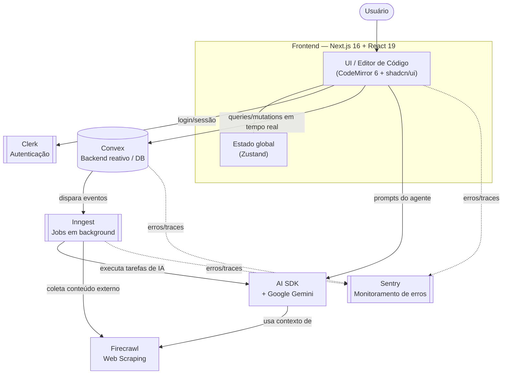

# Polaris

> Um clone/IDE de código com IA construído em cima do Next.js — editor estilo Cursor/VS Code no navegador, com agente de IA integrado, autenticação, backend em tempo real e jobs em background.


## Sobre o projeto

**Polaris** é uma aplicação web construída com **Next.js 16 (App Router)** e **React 19** que reproduz a experiência de um editor de código assistido por IA, no estilo do Cursor. O nome interno do pacote no `package.json` é `nextjs-cursor-clone`, o que confirma o objetivo do projeto: oferecer um ambiente de edição de código no navegador com um agente de IA capaz de ler, sugerir e escrever código, rodando sobre uma stack moderna full-stack (Next.js + Convex + Clerk + Inngest).

> **Nota de transparência:** este README foi gerado com base no `package.json`, na listagem de pastas do repositório (`convex/`, `public/`, `src/`) e nos arquivos de configuração visíveis publicamente no GitHub. O GitHub bloqueou a navegação automatizada pela árvore completa de `src/`, então alguns detalhes finos de funcionalidades (telas, rotas exatas, nomes de componentes) foram inferidos a partir das dependências instaladas. Recomendo revisar e ajustar as seções abaixo antes de publicar.

## Principais funcionalidades (inferidas da stack)

- **Editor de código no navegador** — powered by [CodeMirror 6](https://codemirror.net/) (`@codemirror/lang-*` para JS, Python, CSS, HTML, JSON e Markdown), com tema `one-dark`, indentação visual (`codemirror-indentation-markers`) e minimapa (`codemirror-minimap`).
- **Agente de IA integrado** — via [Vercel AI SDK](https://sdk.vercel.ai/) (`ai`) com provider **Google Gemini** (`@ai-sdk/google`), permitindo chat/completions e possivelmente geração e edição de código assistida.
- **Web scraping / ingestão de conteúdo** — via [Firecrawl](https://www.firecrawl.dev/) (`@mendable/firecrawl-js`), provavelmente usado para dar contexto externo (documentação, páginas web) ao agente de IA.
- **Backend em tempo real** — [Convex](https://www.convex.dev/) como banco de dados/backend reativo (pasta `convex/`), sincronizando estado entre cliente e servidor sem necessidade de polling manual.
- **Autenticação** — [Clerk](https://clerk.com/) (`@clerk/nextjs`, `@clerk/themes`) cuidando de login, sessões e temas de UI de auth.
- **Jobs em background / filas** — [Inngest](https://www.inngest.com/) (`inngest`, `@inngest/middleware-sentry`) para orquestrar tarefas assíncronas (ex.: processamento de IA, scraping, indexação).
- **Monitoramento de erros** — [Sentry](https://sentry.io/) configurado para edge e server (`sentry.edge.config.ts`, `sentry.server.config.ts`).
- **UI moderna** — biblioteca de componentes baseada em [shadcn/ui](https://ui.shadcn.com/) sobre [Radix UI](https://www.radix-ui.com/) (accordion, dialog, dropdown, tooltip, tabs, etc.), com `components.json` configurado.
- **Layout de painéis redimensionáveis** — `allotment` e `react-resizable-panels`, típico de IDEs (painel de arquivos, editor, terminal/chat lado a lado).
- **Command palette** — `cmdk`, para busca/comandos rápidos (`Cmd+K`) como em editores modernos.
- **Formulários e validação** — `react-hook-form` + `@hookform/resolvers` + `zod`.
- **Gerenciamento de estado global** — `zustand`.
- **Estilização** — Tailwind CSS 4 (`@tailwindcss/postcss`, `tailwindcss`, `tw-animate-css`) com `class-variance-authority` e `tailwind-merge` para variantes de componentes.
- **Gráficos** — `recharts`, possivelmente para dashboards de uso/métricas.
- **Outros utilitários de UI** — `sonner` (toasts), `vaul` (drawers), `embla-carousel-react` (carrosséis), `next-themes` (dark mode), `date-fns`, `unique-names-generator`, `input-otp`, `react-icons`, `@react-symbols/icons`.

## Tech Stack

| Camada | Tecnologia |
|---|---|
| Framework | Next.js 16 (App Router) |
| UI | React 19, Tailwind CSS 4, shadcn/ui, Radix UI |
| Editor de código | CodeMirror 6 |
| IA | Vercel AI SDK + Google Gemini (`@ai-sdk/google`) |
| Backend / dados | Convex |
| Autenticação | Clerk |
| Jobs assíncronos | Inngest |
| Web scraping | Firecrawl |
| Observabilidade | Sentry |
| Estado global | Zustand |
| Formulários | React Hook Form + Zod |
| Linguagem | TypeScript 5 |

## Arquitetura



**Como funciona o fluxo:**

1. O usuário interage com a interface (editor de código + chat de IA) construída em Next.js/React.
2. **Clerk** autentica o usuário e protege as rotas/sessão.
3. **Convex** funciona como banco de dados e backend reativo: qualquer mudança de estado (arquivos, mensagens, projetos) é sincronizada em tempo real com o cliente, sem polling.
4. Ações mais pesadas ou assíncronas (ex.: gerar código, indexar conteúdo, responder o agente) são delegadas ao **Inngest**, que orquestra jobs em background de forma confiável (com retries).
5. O agente de IA usa o **AI SDK** para conversar com o **Google Gemini**, podendo enriquecer o contexto com dados coletados pelo **Firecrawl** (scraping de páginas/documentação).
6. Erros e problemas de performance em qualquer camada (client, server, edge) são reportados ao **Sentry**.

> Este diagrama é uma representação de alto nível inferida a partir das dependências do projeto. Ajuste as setas e componentes conforme a implementação real em `src/` e `convex/`.

## Estrutura do projeto

```
nextjs-polaris/
├── convex/                  # Schema, funções e backend reativo (Convex)
├── public/                  # Assets estáticos
├── src/                     # Código-fonte da aplicação (App Router, componentes, lib)
├── components.json          # Configuração do shadcn/ui
├── eslint.config.mjs        # Configuração do ESLint
├── next.config.ts           # Configuração do Next.js
├── postcss.config.mjs       # Configuração do PostCSS/Tailwind
├── sentry.edge.config.ts    # Configuração do Sentry (Edge Runtime)
├── sentry.server.config.ts  # Configuração do Sentry (Server)
├── tsconfig.json            # Configuração do TypeScript
├── package.json
└── README.md
```

> Os scripts `SYNC-CLOCK.bat`, `sync-clock.ps1` e `fix-clerk-clock.ps1` presentes na raiz sugerem um workaround conhecido: o Clerk valida tokens com base no relógio do sistema, e esses scripts servem para sincronizar o horário local (comum em ambientes Windows/WSL onde o clock desalinha e quebra a autenticação).

## Scripts disponíveis

| Comando | Descrição |
|---|---|
| `npm run dev` | Inicia o servidor de desenvolvimento Next.js |
| `npm run build` | Gera o build de produção |
| `npm run start` | Inicia o servidor em modo produção |
| `npm run lint` | Roda o ESLint no projeto |

